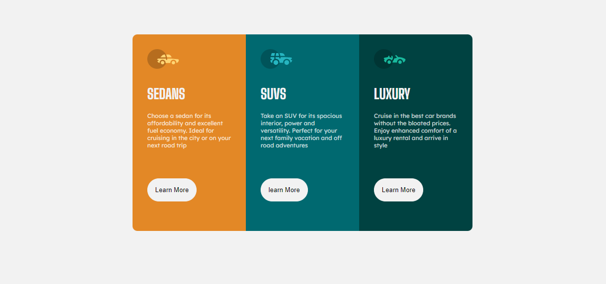
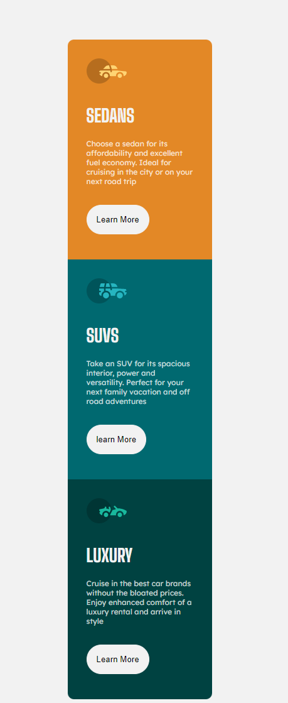

# Frontend Mentor - 3-column preview card component solution

This is a solution to the [3-column preview card component challenge on Frontend Mentor](https://www.frontendmentor.io/challenges/3column-preview-card-component-pH92eAR2-). Frontend Mentor challenges help you improve your coding skills by building realistic projects. 

## Table of contents

- [Overview](#overview)
	  - [The challenge](#the-challenge)
	  - [Screenshot](#screenshot)
	  - [Links](#links)
	- [My process](#my-process)
	  - [Built with](#built-with)
	  - [What I learned](#what-i-learned)
	  - [Continued development](#continued-development)
	  - [Useful resources](#useful-resources)
	- [Author](#author)

## Overview

### The challenge

	Users should be able to:

	- View the optimal layout depending on their device's screen size
	- See hover states for interactive elements

### Screenshot

	
        

### Links

	- Solution URL: (https://github.com/Homorkhay/3-column-preview-card-component-challenge)
	- Live Site URL: (https://homorkhay.github.io/3-column-preview-card-component-challenge/)

## My process

### Built with

	- Semantic HTML5 markup
	- CSS custom properties
	- Flexbox

### What I learned

	I learned about how to use the shorthand property of border-radius.

### Continued development

I want to further develop my CSS skills by learning grid, z-index, overflow & resize properties and lastly list & calc function

### Useful resources

- [LearnVern](https://www.learnvern.com) - This helped me for XYZ reason. I really liked this pattern and will use it going forward.
- [W3SCHOOL](https://www.w3schools.com) - This is an amazing article that helped me finally understand XYZ. I'd recommend it to anyone still learning this concept.

**Note: Delete this note and replace the list above with resources that helped you during the challenge. These could come in handy for anyone viewing your solution or for yourself when you look back on this project in the future.**

## Author

- Frontend Mentor - [@Homorkhay](https://www.frontendmentor.io/profile/Homorkhay)
- Twitter - [@homorkhay](https://www.twitter.com/homorkhay)
